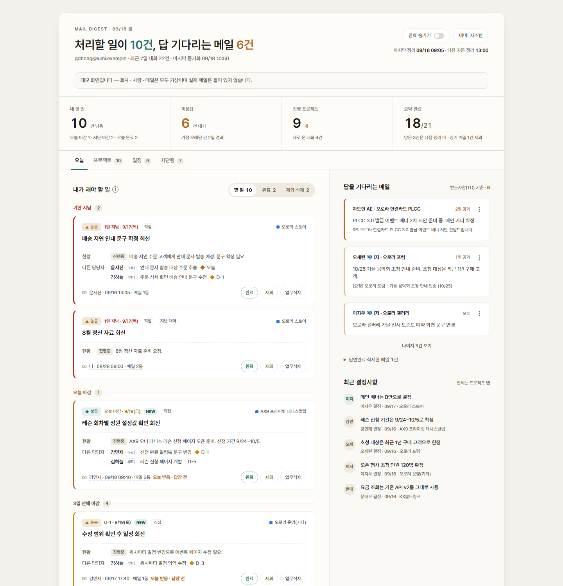
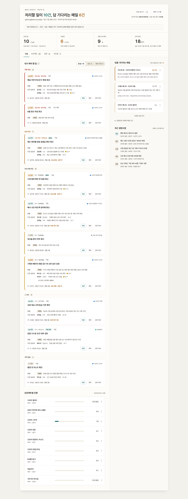
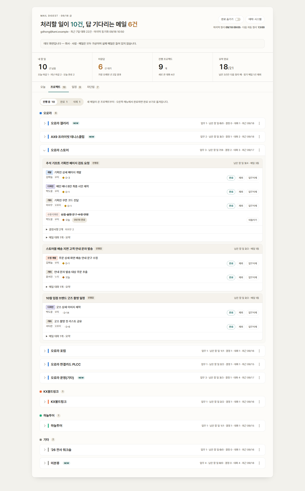
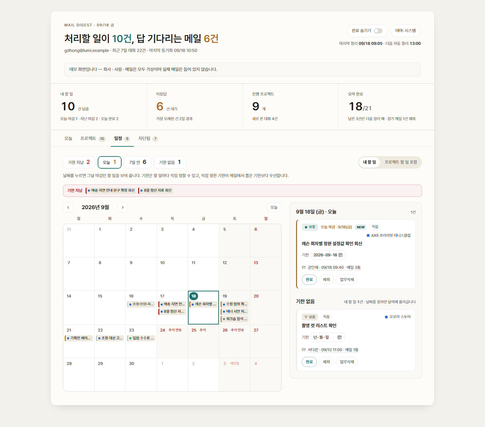
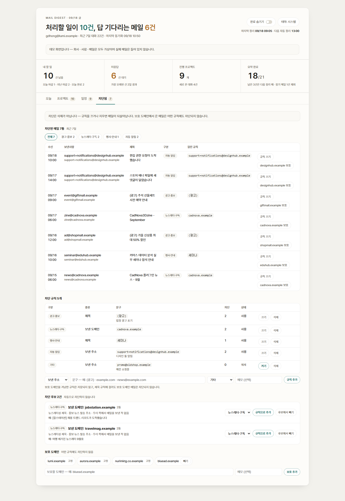
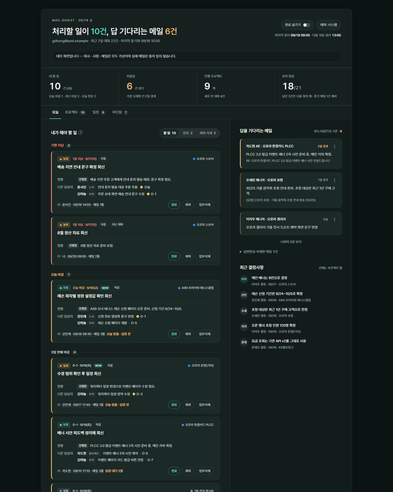
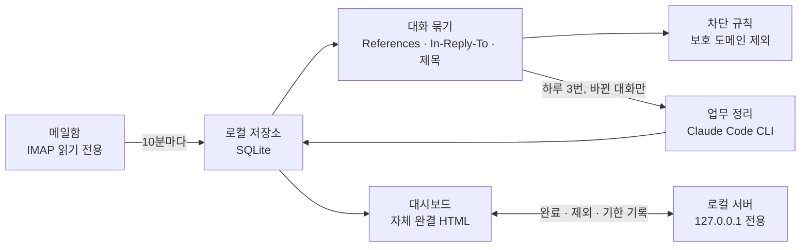

# 메일 업무 비서 (nwmail)

> **해커톤 제출용 공개 샘플입니다.** 화면과 코드는 실제로 쓰고 있는 버전과 같지만,
> 회사 · 사람 · 메일은 모두 가상으로 바꿨습니다. 실제 메일 · 업무 기록 · 설정 파일은 들어 있지 않고,
> 메일 주소와 도메인은 예시 전용 주소(`.example`)라 실제로 연결되지 않습니다.



## 풀려는 문제

고객사 · 대행사 · 사내에서 하루 수십 통씩 오는 업무 메일은 대화마다 흩어져 있습니다.
메일함만 봐서는 **지금 내가 할 일**, **내 답을 기다리는 메일**, **프로젝트별 진행 상황**이
한눈에 들어오지 않고, 결정된 내용은 긴 회신 끝에 묻힙니다.

nwmail 은 메일함을 읽어 **대화(스레드) 단위로 묶고**, AI 가 대화 전체를 읽어
**결정사항 · 업무 · 내 할 일 · 기한**을 정리한 뒤, 내 PC 안에서만 열리는 대시보드 하나로 보여줍니다.

## 화면

| 탭 | 보여주는 것 |
|---|---|
| **오늘** | 내가 해야 할 일 (기한 지남 → 오늘 → 임박 순, 완료 · 제외 · 업무삭제), 답을 기다리는 메일 (받는사람에 내가 있는데 아직 답하지 않은 대화), 프로젝트별 진행 막대, 최근 결정사항 |
| **프로젝트** | 고객사 → 세부 프로젝트 → 같은 메일명 묶음 → 역할(개발 · 디자인 · 수정 · 기타) 태그가 붙은 할 일과 결정사항. 진행 중 · 완료 · 삭제 보기 |
| **일정** | 할 일 마감을 월간 달력에 (공휴일 표시). 기한을 직접 정하면 메일에서 뽑은 기한보다 우선 |
| **차단됨** | 광고 · 뉴스레터 · 행사 · 자동 알림 차단 규칙과 차단 후보 제안. 회사 · 주요 고객사 도메인은 어떤 규칙에도 차단되지 않음 |

<details>
<summary>탭별 전체 화면 보기</summary>

**오늘**



**프로젝트** — 세부 프로젝트를 펼치면 업무 묶음 · 역할 태그 · 결정사항이 보입니다



**일정**



**차단됨**



**다크 모드** (OS 설정을 따르고, 화면의 테마 버튼으로 바꿀 수 있음)



</details>

## 동작 구조



- **수집** `sync.py` — 받은메일함의 최근 메일을 받고, 같은 대화의 과거 메일과 내가 보낸 답장까지 찾아 붙입니다.
- **정리** `extract.py` — 대화 전체를 시간순으로 AI 에 넣어 "무엇이 결정됐고 지금 누가 무엇을 해야 하는지"를 뽑습니다.
- **화면** `dashboard.py` · `serve.py` — 결과를 탭 4개짜리 대시보드로 만들고, 버튼 기록은 로컬 서버가 저장합니다.
- **자동 실행** `setup_schedule.ps1` — Windows 작업 스케줄러로 10분마다 수집 · 화면 갱신, 9 · 13 · 17시에 업무 정리.

## AI 를 쓰는 방식과 비용

- **대화 단위로 읽는다** — 메일 한 통이 아니라 대화 전체를 봐야 결정이 바뀐 것, 이미 끝난 일을 가려낼 수 있습니다.
  정리 결과는 가장 최근 메일 시점의 현재 상태를 기준으로 합니다.
- **인용은 빼고 넣는다** — 답장마다 붙는 이전 메일 인용(실측 본문의 약 97%)을 걷어내고 새로 쓴 부분만 넣습니다.
- **바뀐 대화만 다시 묻는다** — 대화 내용의 지문(해시)이 같으면 이전 결과를 그대로 씁니다. 여러 대화를 한 번에 묶어 보냅니다.
- **정기 보고는 건너뛴다** — 매일 오는 통계 메일처럼 할 일이 거의 없는 대화는 대시보드에만 보이고 정리하지 않습니다.
- **분류는 규칙으로** — 프로젝트 분류(제목 키워드 · 태그 · 발신 도메인)는 화면을 만들 때 규칙으로 다시 정하므로,
  규칙(`projects.json`)을 바꿔도 AI 를 다시 부르지 않습니다.
- **요약 엔진 선택** — `claude_code`(구독 사용량, 추가 과금 없음) · `rules`(LLM 없이 오프라인) · `ollama`(로컬 모델) · `api`(종량 과금).

## 보안 · 개인정보 설계

- **읽기 전용** — IMAP 을 읽기 전용으로 열어 메일을 지우거나 옮기지 않고, 읽음 상태도 바꾸지 않습니다.
- **비밀번호를 파일에 두지 않음** — 외부 앱 비밀번호는 Windows 자격 증명 관리자에 저장합니다.
- **프롬프트 인젝션 방어** — 메일 본문은 신뢰할 수 없는 입력으로 보고, 본문 속 지시문을 따르지 말라고 지시합니다.
- **내 PC 밖으로 나가지 않는 화면** — 대시보드는 외부 리소스를 부르지 않는 단일 HTML 이고, 메일 내용은 전부 이스케이프합니다.
- **로컬 서버 보호** — 127.0.0.1 에서만 열리고, 주소(Host) 검사로 DNS 리바인딩을 막고, 페이지에 심은 토큰이 있어야 기록을 받습니다.
- **보호 도메인** — 회사 · 주요 고객사 도메인은 코드에 고정해 어떤 차단 규칙 · 제안에도 걸리지 않습니다.
- **미리보기 정리** — 인용된 이전 메일과 서명을 걷어내고 전화번호를 가립니다.
- **외부 전송이 안 되는 환경** — `rules` · `ollama` 엔진을 쓰면 메일 본문이 PC 밖으로 나가지 않습니다.

## 데모 실행

Python 3.10 이상이 필요합니다 (3.12 에서 확인).

```bash
pip install -r requirements.txt
```

```bash
python demo/build_demo.py
```

`demo/dashboard.html` 이 만들어집니다. 파일로 열면 모든 탭을 둘러볼 수 있고, 버튼은 잠겨 있습니다.
완료 · 제외 · 기한 · 차단 규칙 버튼까지 눌러 보려면 데모 서버를 켭니다.

```bash
python demo/serve_demo.py
```

http://127.0.0.1:8790/ 로 열면 됩니다. 기록은 `demo/` 안의 데모 DB 에만 저장되고, 처음 상태로 되돌리려면
`python demo/serve_demo.py --reset` 을 씁니다. 데모는 실제 메일함에 접속하지 않고 AI 도 부르지 않습니다
(정리 결과는 `demo/build_demo.py` 에 미리 써 두었습니다).

## 테스트

실제 메일함 · AI 없이 합성 데이터로 끝까지 검증합니다. 7개 스위트, 525개 항목이 통과합니다.

```bash
python test_dashboard.py
```

`test_store.py` · `test_context.py` · `test_extract.py` · `test_filters.py` · `test_server.py` · `test_auto.py` 도 같은 방식으로 실행합니다.
`test_feasibility.py` 는 네이버웍스 서버에 실제로 접속해 보는 연결 점검이라 따로 실행합니다.

## 실제 메일함에 연결하려면

1. `.env.example` 을 `.env` 로 복사하고 메일 주소를 적습니다 (네이버웍스 IMAP, 관리자가 IMAP 을 허용해야 합니다).
2. `python set_password.py` — 외부 앱 비밀번호를 Windows 자격 증명 관리자에 저장합니다.
3. `python sync.py` → `python extract.py` → `python dashboard.py --open`
4. 자동 실행: `pwsh -ExecutionPolicy Bypass -File setup_schedule.ps1`

진단이 필요하면 `python run.py --doctor` 가 막힌 지점과 해결책을 알려줍니다.

## 폴더 구조

```
nwmail/            핵심 모듈 (수집 · 저장 · 대화 묶기 · 정리 · 대시보드 · 로컬 서버 · 차단)
demo/              데모 데이터 생성 · 데모 서버 · 미리 만든 데모 화면(dashboard.html)
docs/screenshots/  README 화면
projects.json      프로젝트 식별 규칙 (고객사 > 세부 프로젝트 > 제목 키워드, 별칭, 도메인)
sync.py · extract.py · dashboard.py · serve.py · auto.py   실행 스크립트
test_*.py          검증 스위트
```

## 이 공개본에 대해

- 실제로 쓰고 있는 버전에서 회사 · 사람 · 프로젝트 이름, 메일 제목 · 주소를 일관된 가명으로 바꾼 사본입니다.
  치환은 코드 · 설정 · 테스트에 똑같이 적용했고, 치환 후에도 테스트가 모두 통과합니다.
- 실제 메일 DB · 업무 기록 · `.env` · 인증서 · git 이력은 포함하지 않습니다.
- 실제 메일 DB 에서 뽑은 주소 · 도메인 · 이름 · 제목 조각과 이 저장소의 모든 파일을 대조해 겹치는 것이 없음을 확인했습니다.
